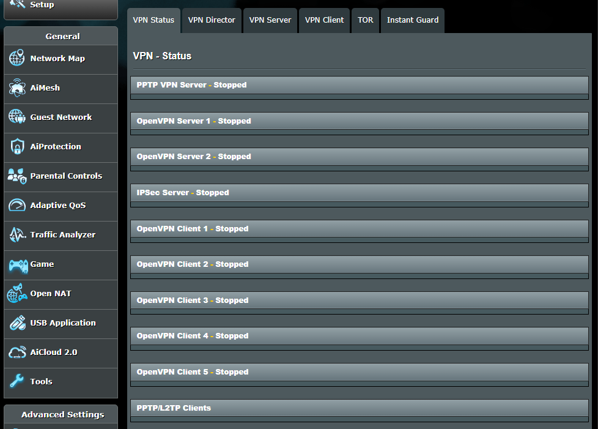
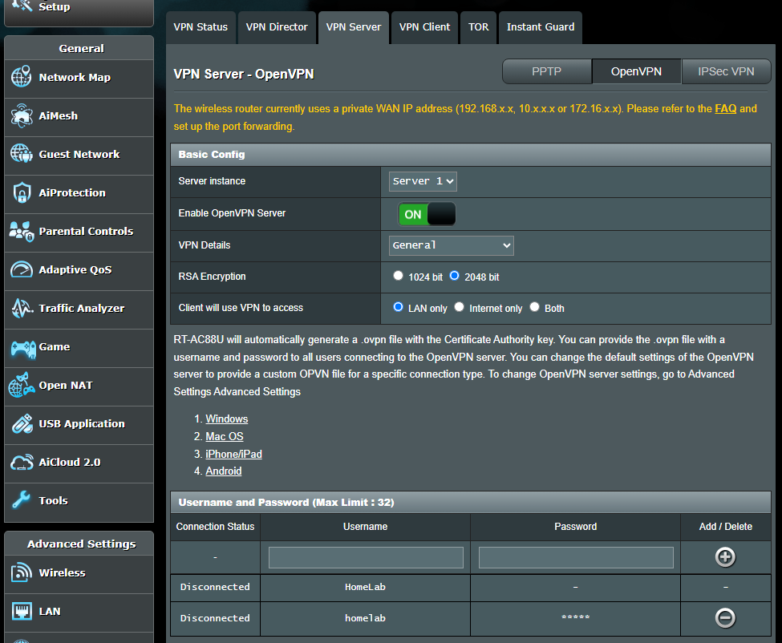
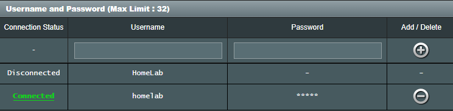
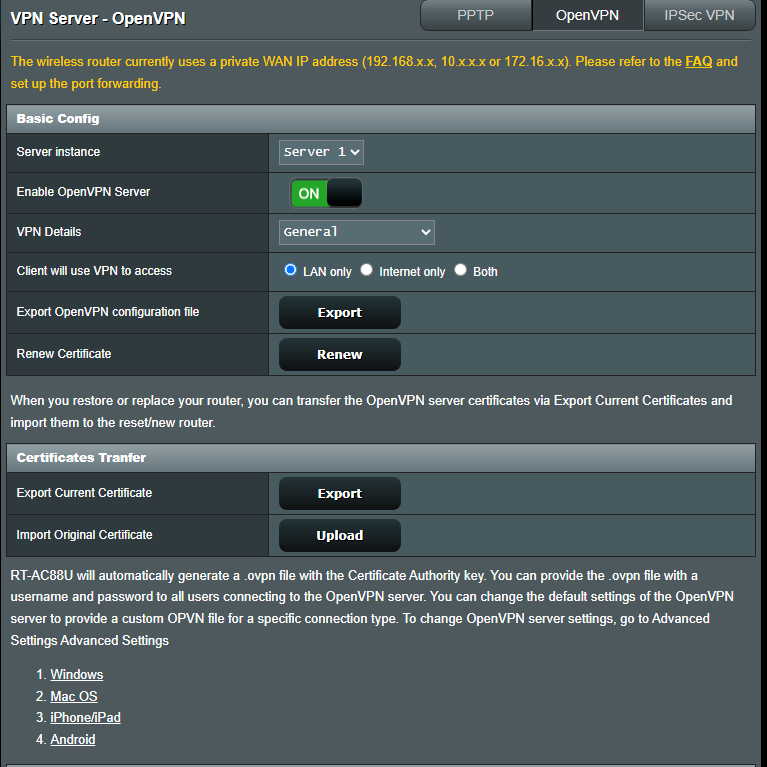
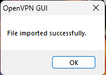
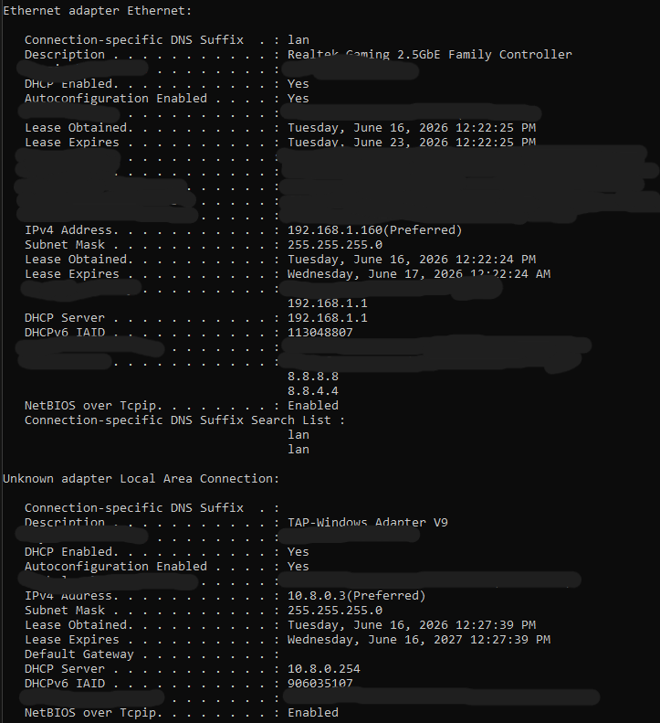
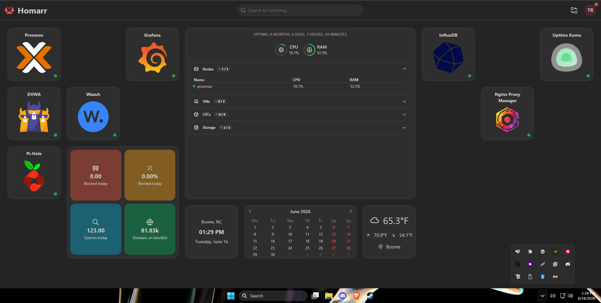

## OpenVPN Server Setup  
**Objective** Enable remote access to my homelab from my PC on a seperate network

**Overview** This document outlines the steps that I took to configure OpenVPN on my ASUS RT-AC88U router running Asuswrt-Merlin firmware. The goal was to enable secure access to my homelab network while connected to a seperate ISP network.

**Tools Used:**
- ASUS RT-AC88U With Merlin Firmware
- OpenVPN Server (Built into Merlin)
- OpenVPN GUI Client (Windows)

## Network Architecture
**Primary Network (Spectrum)**
- Subnet: 192.168.1.X/24
  
**Lab Network (ASUS RT-AC88U)**
- Subnet 192.168.2.X/24
  
**VPN Tunnel**
- Subnet 10.8.0.X/24

## Step 1: Access the VPN Settings
Navigate to VPN -> VPN Status in the Merlin Dashboard. All VPN services will show they're stopped by default.

## Step 2: Configure OpenVPN Server
Click the VPN Server tab and select OpenVPN,
I configured the following settings:
- Enable OpenVPN server -> On
- RSA Encryption -> 2048 Bit
- Client will use VPN to access -> LAN only

## Step 3: Create VPN User
I then created a new username and password for my user account to access the VPN.

## Step 4: Export OpenVPN Configuration File
Click Export next to "Export OpenVPN configuration file" to download the .ovpn file that we need.

## Step 5: Install OpenVPN Client
I downloaded and installed OpenVPN on my main PC, and imported the .ovpn file
- Right clicked the OpenVPN system tray icon 
- Click import file
- Select the downloaded .ovpn file
After those steps I successfully imported the file

## Step 6: Connect and Verify
Once I successfully imported the .ovpn file I confirmed that I was able to access the homelab network from a different network.

This screenshot shows both my main Ethernet connection at the top. At the bottom the "Unknown adapter" is the VPN, and you can see in the description that its labeled "TAP-Windows Adapter V9". It's IPv4 address is in the corrent subnet that we established earlier 10.8.0.3. 

From this screenshot I'm able to access my Homarr dashboard while connected to the VPN on a seperate network.

## Why This Setup Is Secure
**Network Segmentation**
I've setup the homelab to be on a subnet that is completly seperated (192.168.2.X) from the primary home network (192.168.1.X). This means that if there were to be a vulnerability exploited within my lab enviroment, it cannot directly affect my home network. This mirrors the concept of network segmentation used in enterprise environments to contain lateral movement during a breach.

**RSA 2048-bit Encryption**
The OpenVPN server is configured with 2048-bit encryption for certificate generation. I made this change to 2048 from 1024 because 1024-bit encryption is considered deprecated by NIST, and is vulnerable to attacks with modern computing resources. 

**Layers of Defense**
My setup has multiple layers of security, following the defense in depth principle in frameworks like NIST SP 800-53.
- Layer 1: The physical network isolation, my lab devices are on a seperate router and subnet than my home network
- Layer 2: The firewall on the ASUS RT-AC88U with merlin enforces all firewall rules between networks
- Layer 3: VPN Encryption, All cross-network communication is encrypted by OpenVPN
- Layer 4: Authentication, Username + password alongside a certificate is required to access the VPN
- Layer 5: Monitoring, Wazuh SIEM and Suricata IDS monitor all lab trafic
